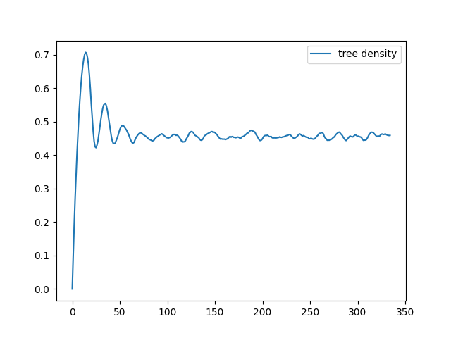

# PythonForestFire

Implements the Drossel-Schwabl forest fire model

* Visualisation using Pygame

  

* Records, outputs and plots simulation statistics

  

* Set up to be easily extended and generalised
